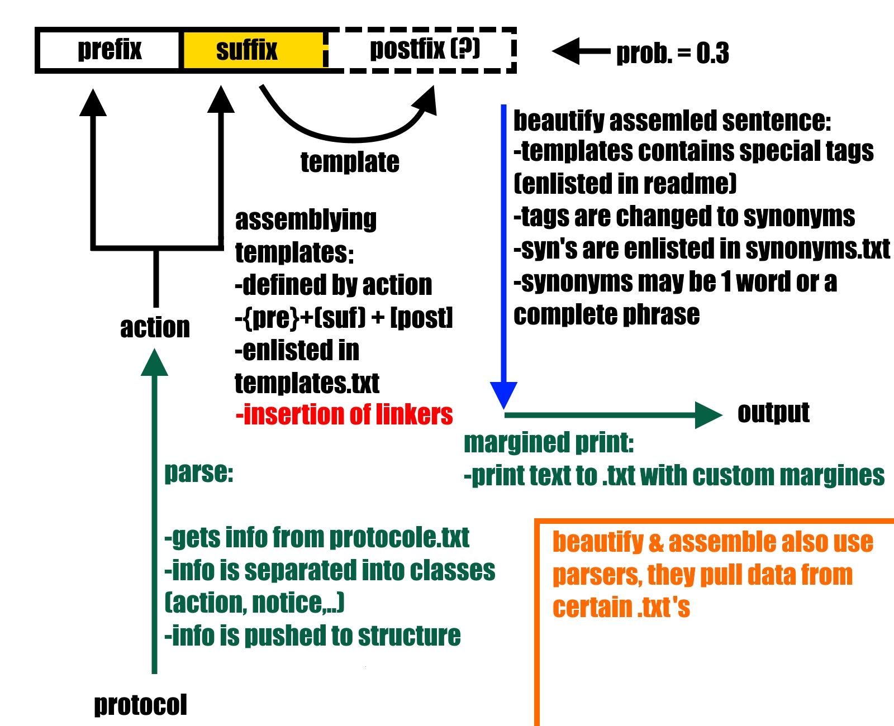

# Random-Text-Generator

Генератор описания хода гонки по заранее известному протоколу.

## Формат входных данных 

Каждое событие на гоночной трассе заносится в файл протокола в следующем формате: 
```text
НОМЕР_КРУГА     ТЕГ_ГОНЩИКА     ДЕЙСТВИЕ    КОММЕНТАРИЙ
```
`ДЕЙСТВИЕ` и `КОММЕНТАРИЙ` узказываются в соответствии с форматом:
```text
ДЕЙСТВИЕ        КОММЕНТАРИЙ     ОПЦИОНАЛЬНЫЙ КОММЕНТАРИЙ
старт		позиция
обгон		пилот		примечание
перемещ		позиция		примечание
ошибка		примечание
сход		причина
питстоп		примечание
пейскар		причина		примечание
лучшкруг	время
борьба		пилот		позиция_до	позиция_после	примечание
лидер		отрыв
столкнов	пилот		примечание
проблема	примечание
финиш		позиция
круг		круг
```
Также имеется возможность указать расшифровку тега гонщика в файле `names.txt` в трех падежах: 
именительном, родительном и дательном в следующем формате:
```
ТЕГ_ГОНЩИКА ; ИМЯ_И.п. Фамилия_И.п. ; ИМЯ_Р.п. Фамилия_Р.п. ; ИМЯ_Д.п. Фамилия_Д.п.
```

## Алгоритм

Программа считывает каждое событие и по типу действия собирает прототип предложения из шаблонов, 
которые находтся в файле `templates.txt`. Составленное предложение содержит в себе ряд тегов для
распространения:

Теги, используемые для подстановки основной информации конкретного события с учетом верных падежных форм:

Тег | Значение
--- | ---
`\s1nc` | Имя гонщика в И.п.
`\s1gc` | Имя гонщика в Р.п.
`\s1dc` | Имя гонщика в Д.п.
`\s2nc` | Имя гонщика из примечания в И.п.
`\s2gc` | Имя гонщика из примечания в Р.п.
`\s2dc` | Имя гонщика из примечания в Д.п.
`\n` | Информация из примечания
`\n-\dend` | окончание цифр (3-им, 54-ым)
`\n-\cars` | позиция участника минус один
`\rand` | случайная цифра от 1 до 10

Теги, используемые в словаре `synonyms.txt` для осуществления верной, с точки зрения русского языка, подстановки 
случайных слов и фраз:

Тег | Значение
---|---
`PRT` | участник в И.п
`PRT_gc` | участник в Р.п
`PRT_dc` | участник в Д.п
`ADJ_GOOD_ng` | хорошее прил. в ср.р.
`ADJ_GOOD_mg` | хорошее прил в м.р.
`ADJ_GOOD_mg_gc` | хорошее прил в м.р. Р.п
`ADJ_BAD_ng` | плохое прил. в ср.р.
`ADJ_BAD_mg` | плохое прил в м.р.
`ADV_GOOD` | хорошее нар.
`ADV_BAD` | плохое нар.
`ADV_TOUGH` | "закономерно" нар.
`ADV_ACC` | неожиданно нар.
`VERB_WIN` | гл. побеждать
`VERB_ERR` | гл. ошибки
`VERB_WILL` | гл. волеизъявления
`VERB_SHOW` | гл. показать
`VERB_OVER` | гл. обгона
`VERB_MOVE` | гл. перемещения
`VERB_FIGHT` | гл. противостояние
`VERB_TAKEOFF` | гл. начала
`EXC_BAD` | плохое восклицание
`EXC_GOOD` | хорошее восклицание
`MOVE` | движение, маневр
`TURN` | поворот
`FIGHT` | противостояние
`1stPRIZE` | 1 место турнира в И.п.
`1stPRIZE_gc` | 1 место турнира в Р.п

Основываясь на этих тегах, программа подбирает случайное подходящее слово из баз данных. 
Полученный в результате этих манипуляций текст выводится в текстовый файл. Текст также 
выравнивается по ширине.



## Пример работы программы

Чтобы продемонстрировать случайность генерации текста, приводим примеры выходных файлов для текущего входного:
```text
1	HAM		старт		1
1	WEB		старт		2
2	WEB		обгон		HAM
2	WEB		лидер		2.0с
3	WEB		финиш		1
3	HAM		финиш		2
```
Выходной файл 1:
```text
Чемпионат вот-вот стартует,  бурные апплодисменты публики предвещают интересное зрелище. У 
Хэмильтона  хорошая позиция  на старте. Он начинает 1-ым. У лихача Веббера отличное место! 
Он  стартует 2-ым. Спустя некоторое время ужасный пилот  Хэмильтон уступает позицию лихачу 
Вебберу. Невероятно! Легендарный гонщик Марк Веббер находится на первом месте в гонке. Его 
отрыв 2.0с.  Через несколько секун Марк  Веббер уверенно финиширует  1-ым.  Затем водитель 
Хэмильтон почти бузепречно пересекает финишную черту 2-ым. Наконец речь победителя гонки - 
Марка Веббера:  "Я всегда  верил  в то, что никогда  нельзя сдаваться. Нужно  продолжаться 
сражаться, даже если есть малейший шанс. И сегодня я  доказал это, сумев одержать победу в 
гонке".  
```
Выходной файл 2:
```text
Гонщики стоят  на  позициях,  публика  встречает  их  бурными  апплодисментами.  У  лихача 
Хэмильтона  отличное место!  Он  стартует 1-ым.  У  Веббера  хорошая позиция на старте. Он 
начинает   2-ым.  Далее   Гонщик  Веббер  заслуженно  подрезает  Хэмильтона  в  результате  
блистательного маневра. Ого! Марк Веббер находится на первом месте в гонке.  Отрыв  сейчас 
2.0с. Потом Марк Веббер  достойно  финиширует  на  позиции  1. Спустя мгновение, Хэмильтон 
финиширует  2-ым. И наконец речь победителя гонки: "Даже  когда у  вас  не лучшая  машина, 
всегда надо верить,  что именно эта гонка станет вашей лучшей. Это – часть моей мотивации. 
Мотивация - это оружие, которое помогло мне сеголня победить".  
```
Выходной файл 3:
```text
Уже почти полдень. Волнение публики нарастает. Вот появились первые  участники  на старте. 
Крики  и бурные  апплодисменты заглушают рёв моторов.  И вот,  наконец,  начинается гонка! 
Пожелаем  успехов участникам  и будем вместе наблюдать за  развитием событий. У Хэмильтона 
отличное место! Он стартует 1-ым. У гонщика Веббера хорошая позиция на старте. Он начинает 
2-ым. Вот и слабый лихач Хэмильтон из за невезения проигрывает позицию Марку Вебберу. Ого! 
Невероятный  Веббер выходит  на  первую  позицию.  Его  отрыв от  преследователя 2.0с. Тем 
временем  пилот   Веббер  почти  бузепречно  финиширует  на  позиции  1.  Льюис  Хэмильтон  
заканчивает  2-ым. И  наконец речь победителя  гонки: "Я  всегда верил в то,  что  никогда 
нельзя сдаваться. Нужно продолжаться сражаться, даже  если есть малейший шанс. И сегодня я 
доказал это, сумев одержать победу в гонке".  
```